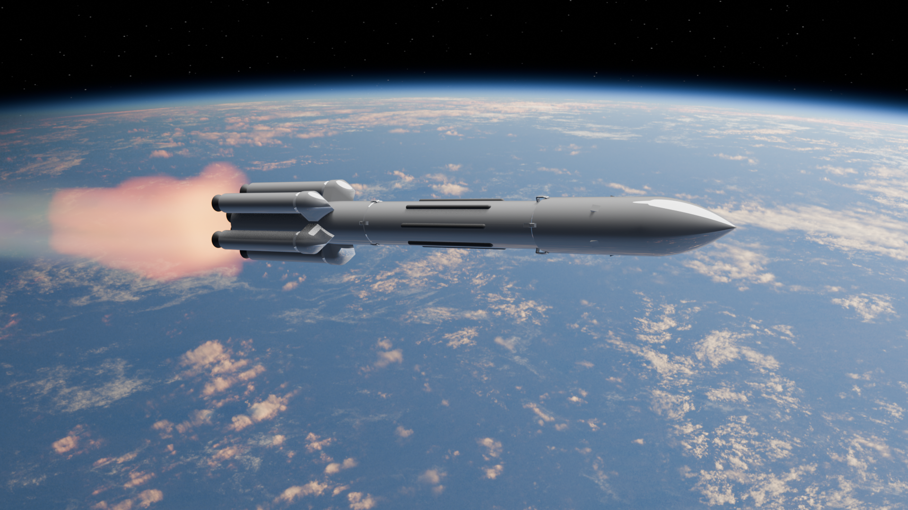

  На большинстве современных ракет используется в качестве топлива и окислителя керосин и кислород соответственно, керосин очень сильно загрязняет окружающую среду, а также является дорогим топливом. Следовательно, надо искать замену керосину.
  Ракета — летательный аппарат, двигающийся в пространстве за счёт действия реактивной тяги, возникающей только вследствие отброса части собственной массы аппарата и без использования вещества из окружающей среды. Поскольку полёт ракеты не требует обязательного наличия окружающей воздушной или газовой среды, следовательно, он возможен не только в атмосфере, но и в вакууме. Словом ракета обозначают широкий спектр летающих устройств от праздничной забавы до космической ракеты-носителя.
  Ракета-носитель (РН), также ракета космического назначения (РКН) — ракета, предназначенная для выведения полезной нагрузки в космическое пространство.
  Иногда термин «ракета-носитель» применяется в расширенном значении: ракета, предназначенная для доставки в заданную точку (в космос либо в отдалённый район Земли) полезной нагрузки — например, искусственных спутников Земли, космических кораблей, ядерных и неядерных боевых блоков. В такой трактовке термин «ракета-носитель» объединяет термины «ракета космического назначения» (РКН) и «межконтинентальная баллистическая ракета».
  Космические ракеты – это средства доставки на орбиту околоземных и планетарных аппаратов и оборудования. Эти мощные машины позволяют совершать полеты в космос, исследовать удаленные уголки вселенной, а также обеспечивать связь и навигацию на Земле.
  История космических ракет берет свое начало во второй половине XX века, когда человечество впервые смогло запустить искусственный спутник Земли. С тех пор ракетостроение активно развивается, появляются все более мощные и эффективные ракеты, способные не только вывести грузы на орбиту, но и отправить их к другим планетам.
  Современные космические ракеты бывают различных типов - носители для запуска спутников, грузовые корабли для доставки грузов на МКС, ракеты-носители для запуска межпланетных зондов и даже пилотируемых космических аппаратов. Каждая из них имеет свои особенности и предназначена для выполнения определенной задачи.
  Технологии ракетостроения совершенствуются из года в год, и в будущем можно ожидать появления еще более мощных и инновационных ракет, способных открывать новые возможности для исследования космоса.

  В наше время развитие космических технологий очень важно для изучения космоса, астрономических исследований, развития телекоммуникаций, освоения новых земель и разработки новых навигационных и двигательных систем.
  Развитие космических аппаратов остается актуальным и важным направлением в современном мире по ряду причин:

  1.	Исследование космоса: космические аппараты позволяют нам изучать и понимать завораживающие тайны космоса, открывая новые планеты, галактики, черные дыры и другие удивительные объекты.
  2.	Технологический прогресс: разработка и создание космических аппаратов требует использования самых передовых технологий, что способствует научному, инженерному и технологическому прогрессу.
  3.	Космическая экономика: космические аппараты могут быть использованы для коммерческих целей, таких как спутниковая связь, спутниковая навигация, а также добыча полезных ископаемых на других планетах.
  4.	Национальная безопасность: космические аппараты играют важную роль в обеспечении национальной безопасности путем наблюдения за территориями, обнаружения боеголовок и мониторинга вооруженных конфликтов.
  5.	Космические исследования: космические аппараты позволяют ученым изучать воздействие космической среды на живые организмы, а также проводить эксперименты и исследования, которые невозможно провести на Земле.
  Таким образом, развитие космических аппаратов остается актуальным и важным направлением, которое принесет нам много новых знаний и технологических достижений.

  Главные проблемы почему людям затруднительно строить космические аппараты, это высокая стоимость и экологическое загрязнение.
  Проблема высокой стоимости заключается, как и в стоимости самой ракеты и материалов для нее, так и в стоимости топлива, которое для нее используется.
  Так же есть и проблема экологического загрязнения из-за того, что, во-первых, части корпуса, которые отцепляются при полёте ракеты падают на Землю, но к счастью, большинство космического мусора сгорает в атмосфере перед тем, как упасть на землю, а во-вторых, это топливо, результат сгорания которого загрязняет Землю, и разрушает озоновый слой.

  Использование методов ТРИЗ помогло в постановлении задач и решении проблем проекта.
1.	С помощью метода вынесения, были отделены части ракеты, у которых нет проблем и части ракеты у которых есть проблемы, которые надо решить. Таким образом было легче улучшить проект во многих сферах.
2.	С помощью теоретического метода анализа удалось проанализировать и исследовать систему проблемных частей ракеты и найти им решения.
3.	С помощью практических работ были изучены объемные темы и обобщил полученные знания.
  Для создания ракеты на кислородно-метановом двигателе необходимо применить методы проектирования и исследования, чтобы обеспечить эффективную работу двигателя и безопасность полета. 
  Одним из первоочередных этапов проектирования является математическое моделирование работы двигателя с использованием специализированных программ и методов. Это позволяет оптимизировать конструкцию двигателя, учитывая различные параметры, такие как температура, давление, расход топлива и т.д. 
    Далее следует проведение экспериментальных исследований, например, испытания отдельных компонентов двигателя, его узлов и систем в различных условиях. Это позволяет выявить возможные проблемы и недостатки, а также оптимизировать работу двигателя.
  Также важным этапом проектирования является анализ работы системы управления и стабилизации ракеты, чтобы обеспечить точное управление полетом и безопасное приземление. 
Эффективное применение методов проектирования и исследования позволит создать ракету на кислородно-метановом двигателе, которая будет обладать высокой мощностью, минимальным расходом топлива и надежностью в работе.

  Сейчас спрос на космические аппараты есть, но лишь в некоторых странах. Покупка такого дорогого аппарата недоступна для многих компаний, поэтому данный проект направлен на развитие возможностей запуска космических аппаратов.
  Спрос на ракету с кислородно-метановым двигателем зависит от многих факторов, включая потребности космических агентств, коммерческих запусков и исследовательских миссий. 
В настоящее время кислородно-метановые двигатели используются в различных ракетах, таких как SpaceX Starship и Blue Origin New Glenn. Эти двигатели считаются более эффективными и экологически чистыми по сравнению со стандартными двигателями на топливе типа RP-1/LOX. 
  С увеличением интереса к исследованию космоса, развитию коммерческого космического туризма и планам колонизации других планет спрос на ракеты с кислородно-метановыми двигателями может увеличиваться.         Однако точный объем спроса зависит от различных факторов и может изменяться со временем.

  Заключительный вариант ракеты на кислородно-метановом двигателе представляет собой современное космическое средство, способное осуществлять полёт на большие расстояния. Ракета оборудована двигателем, работающим на кислороде и метане, что обеспечивает высокую эффективность и экономичность использования топлива.
  Изделие выполнено из прочных и лёгких материалов, что позволяет снизить вес ракеты и увеличить её грузоподъёмность. На корпусе ракеты расположены крылья и рули управления, что обеспечивает точное управление движением.
  В ракете установлена современная система навигации и автоматизированного управления, что обеспечивает точное направление полёта и безопасную посадку. Также в изделии предусмотрены системы безопасности и аварийного сброса, что обеспечивает надёжное функционирование в экстремальных ситуациях.
  Заключительный вариант ракеты на кислородно-метановом двигателе представляет собой передовое космическое средство, способное успешно осуществлять межпланетные полёты и исследования космоса.

  В итоге, по окончанию работы над проектом удалось создать прототип ракеты на кислородно-метановом двигателе, который частично показывает систему работы задуманного проекта. При создании проекта были получены такие улучшения как:
  1. Экономия на топливе: кислородно-метановый двигатель является более эффективным и экономичным по сравнению с другими типами ракетных двигателей.
  2. Увеличение мощности: использование кислородно-метанового топлива позволяет создать более мощный двигатель, что улучшает характеристики космической ракеты.
  3. Экологическая безопасность: кислородно-метановое топливо более чистое и экологически безопасное, что снижает негативное воздействие ракеты на окружающую среду.
  4. Надежность: кислородно-метановый двигатель обладает высокой надежностью и долговечностью, что повышает безопасность и эффективность полетов космической ракеты.
  5. Перспективы развития: использование кислородно-метанового топлива открывает новые возможности для развития космической технологии и исследований в области космоса.

Ссылка на ПЗ: SaT0t1s/RocketOM-0001/Doc/ПЗ - Торутанов Фёдор Николаевич - Космическая ракета на кислородно-метановом двигателе.pdf
